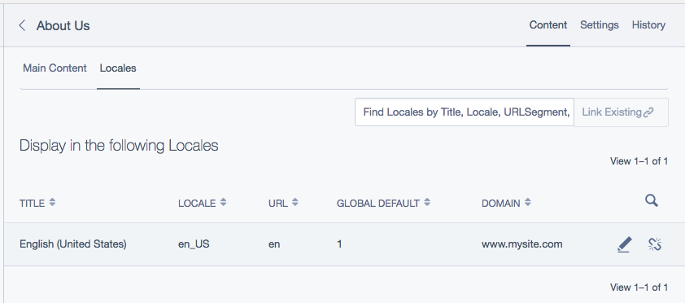

# Localisation scenarios

Below are some common scenarios and how you can achieve the desired outcome using Fluent, it's configuration settings, and additional extensions.

## Setup

For all scenarios, we will be using the following Locale setup:

### International (default locale)

| Fallback | Sort |
| --- | ---: |
| (none) | 0 |

### United states

| Fallback | Sort |
| --- | ---: |
| International | 1 |

### Canada

| Fallback | Sort |
| --- | ---: |
| United States | 1 |
| International | 2 |

### Australia

| Fallback | Sort |
| --- | ---: |
| International | 1 |

### Japan

| Fallback | Sort |
| --- | ---: |
| (none) | 0 |

**International** is our default Locale.
**International** and **Japan** have no Fallbacks.
**United States** and **Australia** have a Fallback of **International**.
**Canada** first falls back to **United States**, and then **International**.

## Content inheritance for the frontend

### Part one

When a new Page is created and published in the International Locale, I also want that Page to immediately appear in the United States, Canada, and Australia Locales. Content for these 3 Locales should be taken from the International version.

When a Localisation is created for United States, Canada should inherit this content (rather than content from International).

#### Solution

By default, DataObjects must be Localised for them to display on the frontend (EG: for a `SiteTree` record, it must have a row in `SiteTree_Live` **and** a corresponding row in `SiteTree_Localised_Live`), however, we can change this behaviour by updating the `frontend_publish_required` configuration.

**Globally:**

```yml
TractorCow\Fluent\Extension\FluentExtension:
  frontend_publish_required: any
```

**For a specific DataObject:**

```yml
MySite\Model\MyModel:
  frontend_publish_required: any
```

#### Result

Changing this configuration will mean that a `SiteTree` record no longer requires a corresponding row in `SiteTree_Localised_Live`, it only requires a row in `SiteTree_Live`.

### Part two

The above works fine for the United States, Canada, and Australia, but pages are **also** showing up in Japan - even though Japan does not fall back to International.

Furthermore, when I create a Page for the United States, the Page correctly displays it's content for Canada, but it also shows up in International, Australia, and Japan.

There are two ways that we can solve these issues.

#### Solution one - filtered locales extension

For this example, we can apply the `TractorCow\Fluent\Extension\FluentFilteredExtension` extension to `SiteTree` to enable us to conditionally show or hide pages within specific locales. Now, when editing a page in the CMS, there will be a gridfield where you can assign visible Locales for this object.

> [!NOTE]
> This Extension can be applied to any DataObject that uses `FluentExtension`.



> [!NOTE]
> Although these objects will be filtered in the front end, this filter is disabled in the CMS in order to allow access by site administrators in all locales.

#### Result {#result-1}

Locales must now be explicately added to the "Locales" tab before they will display on the frontend. The assumption would be that a Content Author will localise the content before adding the Locale to the tab for it to display on the frontend.

#### Solution two - require localisation or fallback localisation

If you don't want to use the Filtered Locales Extension, then we can instead add an additional `augmentSQL` statement to require that a record has **either** a row in `SiteTree_Localised_Live`, or that at least one of it's Fallbacks has a row in `SiteTree_Localised_Live`.

> [!NOTE]
> This `augmentSQL` logic can be applied to any DataObject that uses `FluentExtension` (not just `SiteTree`). It can be particularly useful for DataObjects managed through a ModelAdmin, where you want to provide predictable frontend behaviour, but you don't want the additional complexity of a Filtered Locales tab.

```php
namespace MySite\Extension\SiteTree;

use SilverStripe\CMS\Model\SiteTreeExtension;
use SilverStripe\ORM\DataQuery;
use SilverStripe\ORM\Queries\SQLSelect;
use TractorCow\Fluent\Model\Locale;
use TractorCow\Fluent\State\FluentState;

/**
 * Class SiteTreeFluentExtension
 *
 * @package MySite\Extension
 * @property SiteTree|$this $owner
 * @mixin FluentExtension
 */
class SiteTreeFluentExtension extends SiteTreeExtension
{
    /**
     * @param SQLSelect $query
     * @param DataQuery|null $dataQuery
     */
    public function augmentSQL(SQLSelect $query, DataQuery $dataQuery = null)
    {
        // We only want to apply this logic on the frontend.
        if (!FluentState::singleton()->getIsFrontend()) {
            return;
        }

        // Get the Locale out of the data query.
        $locale = Locale::getByLocale($this->getDataQueryLocale($dataQuery));
        if ($locale === null) {
            return;
        }

        $fallbackRequirements = [];

        foreach ($this->owner->getLocalisedTables() as $table => $fields) {
            // Add a requirement for each Locale in the chain (rather than only for the active Locale).
            foreach ($locale->getChain() as $joinLocale) {
                // See FluentExtension::augmentSQL for JOIN.
                $joinAlias = $this->owner->getLocalisedTable($table, $joinLocale->Locale);

                $fallbackRequirements[] = "\"{$joinAlias}\".\"ID\" IS NOT NULL";
            }
        }

        // Make sure one or more of our requirements match.
        $query->addWhereAny($fallbackRequirements);
    }

    /**
     * Get current locale from given dataquery
     *
     * @param DataQuery $dataQuery
     * @return Locale|null
     */
    protected function getDataQueryLocale(DataQuery $dataQuery = null)
    {
        if (!$dataQuery) {
            return null;
        }

        $localeCode = $dataQuery->getQueryParam('Fluent.Locale') ?: FluentState::singleton()->getLocale();
        if ($localeCode) {
            return Locale::getByLocale($localeCode);
        }

        return null;
    }
}
```

#### Result {#result-2}

Creating a Page anywhere down the International tree will not display on the frontend for Japan (until a localisation has been explicately created for Japan).

Creating a Page in United States will display for United States and Canada, but not for International, Australia, or Japan (until localisations have been explicated created for those Locales).
