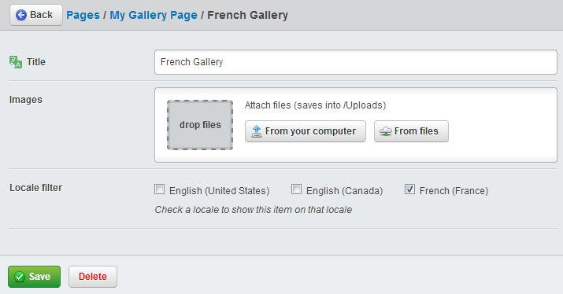

# Configuration

Installation runs more smoothly if you configure your site for localisation before
installing the module, as it will rebuild the database based on configuration.
Good to read this bit first!

Please check [fluent.yml](../../_config/fluent.yml) for the default configuration settings.

Please make sure to REMOVE any `i18n::set_locale` calls from your `_config.php` file, as it
will interfere with locale bootstrapping in certain situations (such as `Security` controller actions).

## Testing configuration

Once you've finished configuring your site, you can run the handy validation task to check if
there are any errors in your config. Examples of errors could include:
 - Invalid default locales
 - Duplicate locales in multiple domains
 - Locales missing from domains

To run this task you can run this on the CLI.

```
./framework/sake dev/tasks/FluentValidateTask 'flush=all'
```

Or go to `http://www.mysite.com/dev/tasks/FluentValidateTask?isDev=1` in your browser.

## Locale configuration

Firstly, you'll need to configure the locales that should be included, as well as
the default locale.

By default the list is blank. You should add the following to your mysite/_config/fluent.yaml

It's advisable to set the default i18n locale to match your site locale

Below demonstrates a typical north american website.

```yaml
---
Name: myfluentconfig
After: '#fluentconfig'
---
Fluent:
  default_locale: en_US
  locales:
    - en_US
    - es_US
	- en_CA
    - fr_CA
---
Name: myfluenti18nconfig
After: '#fluenti18nconfig'
---
i18n:
  default_locale: en_US
```

Additionally, if you prefer to customise the urls (such as having 'english' instead of 'en_US' as a prefix) you can use
the Fluent.aliases configuration to specify url aliases for any locale.

E.g.

```yaml
---
Name: myfluentconfig
After: '#fluentconfig'
---
Fluent:
  default_locale: en_US
  locales:
    - en_US
    - es_US
	- en_CA
    - fr_CA
  aliases:
    en_US: english
    es_US: spanish
```

The home pages for the above locales will be `/english/`, `/spanish/`, `/en_CA/`, and `/fr_CA/`

## Field localisation configuration

Great, now we've setup our languages. Our next job is to decide which dataobjects, and which
fields of those dataobjects, should be localised.

By default Fluent will attempt to analyse the field type and name of each `DBField` specified in your `DataObject`.
Rules specified by `Fluent.field_include`, `Fluent.field_exclude`, `Fluent.data_include`, and `Fluent.data_exclude`
can be customised to tweak this automatic detection behaviour. This filter is used to specify filters based on field
type. `data_` filters filter fields by `DBField` type, where `field_` filters are by name. Regular expressions may
be specified by surrounding your filter with `/filter/`.

Fields can also be filtered directly by name by using the 'translate' config option, set to the fields you want
localised. Note that this must be on the same class as the database field is specified (not subclasses).

```yaml
---
Name: myblogconfig
---
Page:
  translate:
    - 'Heading'
    - 'Description'
```

or via PHP

```php
class Page extends SiteTree {

	private static $db = array(
		'Heading' => 'Varchar(255)',
		'Description' => 'Text',
		'MetaNotes' => 'Text'
	);

	private static $translate = array(
		'Heading',
		'Description'
	);
}
```

In the above example, Heading and Description will be translated but not MetaNotes.

If you want to localise a `has_one` relation then you can add the field (with 'ID'
suffix included).

```yaml
BlogHolder:
  translate:
    - 'OwnerID'
```

Note: If you wish to translate `has_many` or `many_many` then those objects will need
to be filtered via another method. See [Locale based filter configuration](#locale-based-filter-configuration)

If you want to localise a dataobject that doesn't extend sitetree then you'll need
to add the appropriate extension

```yaml
---
Name: myextensions
---
MyDataObject:
  extensions:
    - 'FluentExtension'
```

Set the translate option to 'none' to disable all translation on that dataobject.

```php
class FormPage extends Page {
	private static $translate = 'none';
}
```

## Using custom controllers

If you are using custom controllers (such as for rendering rss, ajax data, etc) you
should probably also add the `FluentContentController` extension in order to ensure
the locale is set correctly for generated content.

```yaml
---
Name: mycontrollerconfig
---
MyAjaxController:
  extensions:
    - 'FluentContentController'
```

If you are using your custom controller in the CMS then you should implement
an `isFrontend` method in your class in order to tell Fluent to treat it as an
admin's view. This means:

 * It will respect the value selected in the CMS locale dropdown.
 * It won't interfere with the view of the website in the frontend.
 * All locale-filtered objects will be available unfiltered to this controller.

```php
class MyAdminController extends Controller {
	public function isFrontend() {
		return false;
	}
}
```

## Locale based filter configuration

In addition to localising fields within a DataObject, a filter can also be applied
with the `FluentFilteredExtension` extension to conditionally show or hide DataObjects
within specific locales.

For example, this could be applied to a `Product` with limited availability in other countries.

This feature is also necessary in cases where has_many or many_many relationships will need
to be customised for each locale. Rather than creating a `ThisClass_OtherClass_{en_NZ}` table
for each locale, the `DataObject` on each (or one) end will have this filter applied
to it. Internally this will create a `LocaleFilter_{en_NZ}` column on the specified
`DataObject` table for each locale.

Note: It's not necessary to actually localise this object in order for it to be
filterable; `FluentFilteredExtension` and `FluentExtension` each work independently.

Warning: This must be added to the base class, such as `SiteTree` in order for it to filter
for pages, or for queries of that base type.

```yaml
---
Name: myproductconfiguration
---
Product:
  extensions:
    - 'FluentFilteredExtension'
```

Make sure that if (and only if) you are filtering a DataObject that doesn't call the default field scaffolder (such
as by calling `parent::getCMSFields()`), make sure that your code calls `extend('updateCMSFields', $fields)`
as demonstrated below.

```php
function getCMSFields() {
	$fields = new FieldList(
		new TextField('Title', 'Title', null, 255)
	);
	$this->extend('updateCMSFields', $fields);
	return $fields;
}
```

Now when editing this item in the CMS there will be an additional set of checkboxes
labelled "Locale filter".



Note: Although these objects will be filtered in the front end, this filter is disabled
in the CMS in order to allow access by site administrators in all locales.

## Customise Menu by Locale

Similarly to how `FluentFilteredExtension` works, a `SiteTree` can have its appearance in the navigation controlled
on a locale-by-locale basis by adding the `FluentMenuExtension` extension. Adding this will replace the
ShowInMenu field under the Settings tab with a locale selector. This must be added to the `SiteTree`
class, not `Page` or any other subclass.

```yaml
---
Name: myproductconfiguration
---
SiteTree:
  extensions:
    - 'FluentMenuExtension'
```

## Fulltext Search

Since full text search queries are very distinct, DB specific filters must be assigned to handle these queries.

By default there is only a `FluentMySQLSearch` to handle MySQL search transformations, but adapters for other DBs can
be specified by adding a class to the `Fluent.search_adapters` config.

Adapters can be disabled by setting the appropriate option to null.

```yaml
---
Name: mysearchadapter
---
Fluent:
  search_adapters:
    MySQLDatabase: ''
    PostgreSQLDatabase: MyPostgreAdapter
```

Search localisation is quite fragile, and is likely to break with future framework updates!

## Locale detection

When a visitor lands on the home page for the first time, fluent can attempt to detect that user's locale based
on the `Accept-Language` http headers sent.

This functionality can interefere with certain applications, such as facebook opengraph tools, so it
is turned off by default. To turn it on set the below setting:

```yaml
Fluent:
  detect_locale: true
```

## Saved locale

When a visitor has viewed a page on the website before, and returns in subsequent sessions, fluent can attempt
to redirect requests for the default home page to the home page of that recently viewed locale. This behaviour
is turned off by default, but it can be turned on by setting the `remember_locale` option.

```yaml
Fluent:
  remember_locale: true
```

If you wish to completely turn off the locale persisting in the front end (for example, in case your site is stateless
and should not write session or cookies) you can disable the persist key as below.

```yaml
Fluent:
  persist_id: ''
```

Note: It's recommended not to remove persist_id_cms, as certain CMS functionality may not work properly
or may detect the wrong locale.
