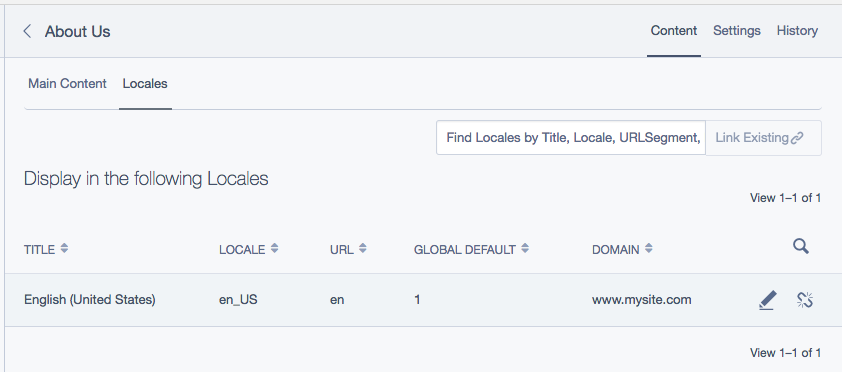

# Configuration

Most configuration is done via the CMS locales section.

Please make sure to REMOVE any `i18n::set_locale` calls from your `_config.php` file, as it
will interfere with locale bootstrapping in certain situations (such as `Security` controller actions).

## Locale configuration

You can create locales via the `/admin/locales` CMS section. Once you add at least two
locales to your site, you can begin localising your content.

Each locale has these fields in the CMS editor:
 - `Locale`: Dropdown which lets you select a locale code from the global locale source
 - `Title`: Name to use for this locale in the locale switcher
 - `URL Segment`: Defaults to the locale (e.g. `en_NZ`) but can be customised. Must be unique.
 - `Default`: Check this to set as the global default. Note: If using domains, you can
   additionally assign per-domain defaults as well.
 - `Domain`: Dropdown to assign this locale to a domain.
 - `Fallbacks`: Allows you to specify one or more fallback locales for this locale.

## Default locale options

If you prefer to keep the prefix off from all links in the default locale, you can set the
`TractorCow\Fluent\Extension\FluentDirectorExtension.disable_default_prefix` option via
YML config. When this is enabled, the prefix will only be prepended to the beginning of
links to non-default locales.

E.g.

```yaml
---
Name: myfluentconfig
---
TractorCow\Fluent\Extension\FluentDirectorExtension:
  disable_default_prefix: true
```

If this is left at the default, false, then the prefix will only be omitted for the
home page for the default locale, instead of all pages.

It is recommended to leave this on in order to ensure the correct locale is set for every page,
but in some cases (especially when upgrading websites) it may be better to keep existing urls
for the default locale intact.

## Field localisation configuration

Great, now we've setup our languages. Our next job is to decide which DataObjects, and which
fields of those DataObjects, should be localised.

By default Fluent will attempt to analyse the field type and name of each `DBField` specified in your `DataObject`.
Rules specified by the below configs can be used to determine if a field should be included
or excluded, either by name, or by type (in order of priority):

 - `TractorCow\Fluent\Extension\FluentExtension.field_exclude` Exclude by name
 - `TractorCow\Fluent\Extension\FluentExtension.field_include` Include by name
 - `TractorCow\Fluent\Extension\FluentExtension.data_exclude` Exclude by type
 - `TractorCow\Fluent\Extension\FluentExtension.data_include` Include by type

E.g.

```yaml
---
Name: fluentfieldconfig
---
TractorCow\Fluent\Extension\FluentExtension:
  data_exclude:
    - Varchar(100)
    - DBHTMLText
```

Fields can also be filtered directly by name by using the `translate` config option, set to the fields you want
localised. Note that this must be on the same class as the database field is specified (not subclasses).

```yaml
---
Name: myblogconfig
---
Page:
  translate:
    - 'Heading'
    - 'Description'
```

or via PHP

```php
use SilverStripe\CMS\Model\SiteTree;

class Page extends SiteTree
{
    private static $db = [
        'Heading'     => 'Varchar(255)',
        'Description' => 'Text',
        'MetaNotes'   => 'Text',
    ];

    private static $translate = [
        'Heading',
        'Description'
    ];
}
```

In the above example, Heading and Description will be translated but not MetaNotes.

If you want to localise a `has_one` relation then you can add the field (with 'ID'
suffix included).

```yaml
BlogHolder:
  translate:
    - 'OwnerID'
```

Note: If you wish to translate `has_many` or `many_many` then those objects will need
to be filtered via another method. See [Locale based filter configuration](#locale-based-filter-configuration)

If you want to localise a `DataObject` that doesn't extend `SiteTree` then you'll need
to add the appropriate extension:

```yaml
---
Name: myextensions
---
MyDataObject:
  extensions:
    - 'TractorCow\Fluent\Extension\FluentExtension'
```

Set the translate option to 'none' to disable all translation on that `DataObject`.

```php
class FormPage extends Page
{
    private static $translate = 'none';
}
```

## Locale based filter configuration

In addition to localising fields within a DataObject, a filter can also be applied
with the `TractorCow\Fluent\Extension\FluentFilteredExtension` extension to conditionally
show or hide DataObjects within specific locales. This will create a many_many relationship
between your object and the locales table.

This feature is also necessary in cases where has_many or many_many relationships will need
to be customised for each locale. For example, this could be applied to a `Product` with
limited availability in other countries.

Note: It's not necessary to actually localise this object in order for it to be
filterable; `FluentFilteredExtension` and `FluentExtension` each work independently.

Warning: This must be added to the base class, such as `SiteTree` in order for it to filter
for pages, or for queries of that base type.

```yaml
---
Name: myproductconfiguration
---
Product:
  extensions:
    - 'TractorCow\Fluent\Extension\FluentFilteredExtension'
```

Make sure that if (and only if) you are filtering a DataObject that doesn't call the default field scaffolder (such
as by calling `parent::getCMSFields()`), make sure that your code calls `extend('updateCMSFields', $fields)`
as demonstrated below.

```php
public function getCMSFields()
{
	$fields = new FieldList(
		new TextField('Title', 'Title', null, 255)
	);
	$this->extend('updateCMSFields', $fields);
	return $fields;
}
```

Now when editing this item in the CMS there will be a gridfield where you can assign
visible locales for this object.



Note: Although these objects will be filtered in the front end, this filter is disabled
in the CMS in order to allow access by site administrators in all locales.

## Locale detection

When a visitor lands on the home page for the first time, Fluent can attempt to detect that user's locale based
on the `Accept-Language` http headers sent.

This functionality can interfere with certain applications, such as Facebook opengraph tools, so it
is turned off by default. To turn it on set the below setting:

```yaml
TractorCow\Fluent\Extension\FluentDirectorExtension:
  detect_locale: true
```
