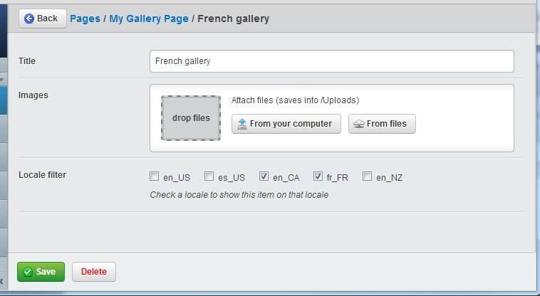

# Fluent

## Simple Silverstripe Localisation

This module allows websites to manage localisation of content, and navigation between localisations,
in a similar fashion to [Translatable](https://github.com/silverstripe/silverstripe-translatable)
or [Multilingual](https://github.com/kreationsbyran/multilingual).

Locales are distinguished by a url prefix, that of the selected locale, at the start
of all page links. E.g. `http://damian.geek.nz/en_NZ/about-me` would be the NZ English
version of a page. This could be localised into Maori at `http://damian.geek.nz/mi_NZ/about-me`

Fluent also integrates nicely with Google Sitemaps module, linking localisations for each page as per 
[Google's internationalisation guidelines](https://support.google.com/webmasters/answer/182192?hl=en&ref_topic=2370587)

Back end control is provided by a simple CMS filter.

| **Locale Menu** | **Locale Menu (expanded)** |
| --------------- | -------------------------- |
|  | ") |

_Please read the [Configuration](#configuration) section before trying to install!_

Also, please [report any issues](https://github.com/tractorcow/silverstripe-fluent/issues)
you may encounter, as it helps us all out!

## Credits and Authors

 * Damian Mooyman - <https://github.com/tractorcow/silverstripe-fluent>
 * Attribution to Michael (dAKirby309) for his metro translate icon - <http://dakirby309.deviantart.com/>

## Requirements

 * SilverStripe 3.1
 * PHP 5.3

## Configuration

Installation runs more smoothly if you configure your site for localisation before
installing the module, as it will rebuild the database based on configuration.
Good to read this bit first!

Please check [fluent.yml](_config/fluent.yml) for the default configuration settings.

Please make sure to REMOVE any `i18n::set_locale` calls from your `_config.php` file, as it
will interfere with locale bootstrapping in certain situations (such as `Security` controller actions).

### Locale configuration

Firstly, you'll need to configure the locales that should be included, as well as
the default locale.

By default the list is blank. You should add the following to your mysite/_config/fluent.yaml

It's advisable to set the default i18n locale to match your site locale

Below demonstrates a typical north american website.

```yaml
---
Name: myfluentconfig
After: '#fluentconfig'
---
Fluent:
  default_locale: en_US
  locales:
    - en_US
    - es_US
	- en_CA
    - fr_CA
---
Name: myfluenti18nconfig
After: '#fluenti18nconfig'
---
i18n:
  default_locale: en_US
```

Additionally, if you prefer to customise the urls (such as having 'english' instead of 'en_US' as a prefix) you can use
the Fluent.aliases configuration to specify url aliases for any locale.

E.g.

```yaml
---
Name: myfluentconfig
After: '#fluentconfig'
---
Fluent:
  default_locale: en_US
  locales:
    - en_US
    - es_US
	- en_CA
    - fr_CA
  aliases:
    en_US: english
    es_US: spanish
```

The home pages for the above locales will be `/english/`, `/spanish/`, `/en_CA/`, and `/fr_CA/`

### Field localisation configuration

Great, now we've setup our languages. Our next job is to decide which dataobjects, and which
fields of those dataobjects, should be localised.

By default Fluent will attempt to analyse the field type and name of each `DBField` specified in your `DataObject`.
Rules specified by `Fluent.field_include`, `Fluent.field_exclude`, `Fluent.data_include`, and `Fluent.data_exclude`
can be customised to tweak this automatic detection behaviour. This filter is used to specify filters based on field
type. `data_` filters filter fields by `DBField` type, where `field_` filters are by name. Regular expressions may
be specified by surrounding your filter with `/filter/`.

Fields can also be filtered directly by name by using the 'translate' config option, set to the fields you want
localised. Note that this must be on the same class as the database field is specified (not subclasses).

```yaml
---
Name: myblogconfig
---
Page:
  translate:
    - 'Heading'
    - 'Description'
```

or via PHP

```php
class Page extends SiteTree {

	private static $db = array(
		'Heading' => 'Varchar(255)',
		'Description' => 'Text',
		'MetaNotes' => 'Text'
	);

	private static $translate = array(
		'Heading',
		'Description'
	);
}
```

In the above example, Heading and Description will be translated but not MetaNotes.

If you want to localise a `has_one` relation then you can add the field (with 'ID'
suffix included).

```yaml
BlogHolder:
  translate:
    - 'OwnerID'
```

Note: If you wish to translate `has_many` or `many_many` then those objects will need
to be filtered via another method. See [Locale based filter configuration](#locale-based-filter-configuration)

If you want to localise a dataobject that doesn't extend sitetree then you'll need
to add the appropriate extension

```yaml
---
Name: myextensions
---
MyDataObject:
  extensions:
    - 'FluentExtension'
```

### Using custom controllers

If you are using custom controllers (such as for rendering rss, ajax data, etc) you
should probably also add the `FluentContentController` extension in order to ensure
the locale is set correctly for generated content.

```yaml
---
Name: mycontrollerconfig
---
MyAjaxController:
  extensions:
    - 'FluentContentController'
```

If you are using your custom controller in the CMS then you should implement 
an `isFrontend` method in your class in order to tell Fluent to treat it as an
admin's view. This means:

 * It will respect the value selected in the CMS locale dropdown.
 * It won't interfere with the view of the website in the frontend.
 * All locale-filtered objects will be available unfiltered to this controller.

```php
class MyAdminController extends Controller {
	public function isFrontend() {
		return false;
	}
}
```

### Locale based filter configuration

In addition to localising fields within a DataObject, a filter can also be applied
with the `FluentFilteredExtension` extension to conditionally show or hide DataObjects
within specific locales.

For example, this could be applied to a `Product` with limited availability in other countries.

This feature is also necessary in cases where has_many or many_many relationships will need
to be customised for each locale. Rather than creating a `ThisClass_OtherClass_{en_NZ}` table
for each locale, the `DataObject` on each (or one) end will have this filter applied
to it. Internally this will create a `LocaleFilter_{en_NZ}` column on the specified
`DataObject` table for each locale.

Note: It's not necessary to actually localise this object in order for it to be
filterable; `FluentFilteredExtension` and `FluentExtension` each work independently.

Warning: This must be added to the base class, such as `SiteTree` in order for it to filter
for pages, or for queries of that base type.

```yaml
---
Name: myproductconfiguration
---
Product:
  extensions:
    - 'FluentFilteredExtension'
```

Make sure that if (and only if) you are filtering a DataObject that doesn't call the default field scaffolder (such
as by calling `parent::getCMSFields()`), make sure that your code calls `extend('updateCMSFields', $fields)`
as demonstrated below.

```php
function getCMSFields() {
	$fields = new FieldList(
		new TextField('Title', 'Title', null, 255)
	);
	$this->extend('updateCMSFields', $fields);
	return $fields;
}
```

Now when editing this item in the CMS there will be an additional set of checkboxes
labelled "Locale filter".



Note: Although these objects will be filtered in the front end, this filter is disabled
in the CMS in order to allow access by site administrators in all locales.

### Fulltext Search

Since full text search queries are very distinct, DB specific filters must be assigned to handle these queries.

By default there is only a `FluentMySQLSearch` to handle MySQL search transformations, but adapters for other DBs can
be specified by adding a class to the `Fluent.search_adapters` config.

Adapters can be disabled by setting the appropriate option to null.

```yaml
---
Name: mysearchadapter
---
Fluent:
  search_adapters:
    MySQLDatabase: ''
    PostgreSQLDatabase: MyPostgreAdapter
```

Search localisation is quite fragile, and is likely to break with future framework updates!

## Installation Instructions

Fluent can be easily installed on any already-developed website

 * Either extract the module into the `fluent` folder, or install using composer

```bash
composer require "tractorcow/silverstripe-fluent": "3.1.*@dev"
```

 * Ensure that all dataobjects have been correctly configured for localisation
   (see [Configuration](#configuration) for details)

 * Run a dev/build to ensure all additional table fields have been generated

## Website template

On the front end of the website you can include the `LocaleMenu.ss` template to provide
a simple locale navigation.

```html
<% include LocaleMenu %>
```

If you are using partial caching then you will need to ensure the current locale is a part of the cache key.

```html
<% cached 'navigation', List(Page).max(LastEdited), $CurrentLocale %>
	<% loop Menu(1) %>	  
		<li class="$LinkingMode"><a href="$Link" title="$Title.XML">$MenuTitle.XML</a></li>
	<% end_loop %>
<% end_cached %>
```

## How it works

As opposed to Translatable which manages separate `SiteTree` objects for multiple 
localisations, Fluent stores all localisations for properties on the same table row.

This method has the following benefits:

 * Seamless integration with other modules and extensions (such as Versioned)
 * Allows for installation easily on existing websites
 * Minimises the amount of special case code to handle localisations; A page has the 
   same ID no matter the current locale!
 * The simplicity of the single-table method means that any object can be easily
   and transparently localised, even non-SiteTree dataobjects.
 * There is only ever one sitemap, so the page hierarchy doesn't need to be 
   duplicated for each additional locale.

Fluent has a couple of built in rules for determining which fields to localise, but
these can be easily customised on a per-object bases (or even by customising the 
global ruleset).

When querying data the SQL is augmented to replace all SELECT fragments for those
fields with conditionals; It will detect if a value for the localised field (such
as `Title_en_NZ`) exists, and use this if it does, otherwise using the base field
(`Title`) as the default. When a dataobject is written, the inverse is performed,
ensuring that the field related to the current locale is correctly written to.

Unfortunately, there's currently no localisation mechanism for sitetree urls
(for the sake of simplicity). This could be implemented if requested however. :)

## License

Revised BSD License

Copyright (c) 2013, Damian Mooyman
All rights reserved.

All rights reserved.

Redistribution and use in source and binary forms, with or without
modification, are permitted provided that the following conditions are met:

 * Redistributions of source code must retain the above copyright
   notice, this list of conditions and the following disclaimer.
 * Redistributions in binary form must reproduce the above copyright
   notice, this list of conditions and the following disclaimer in the
   documentation and/or other materials provided with the distribution.
 * The name of Damian Mooyman may not be used to endorse or promote products
   derived from this software without specific prior written permission.

THIS SOFTWARE IS PROVIDED BY THE COPYRIGHT HOLDERS AND CONTRIBUTORS "AS IS" AND
ANY EXPRESS OR IMPLIED WARRANTIES, INCLUDING, BUT NOT LIMITED TO, THE IMPLIED
WARRANTIES OF MERCHANTABILITY AND FITNESS FOR A PARTICULAR PURPOSE ARE
DISCLAIMED. IN NO EVENT SHALL <COPYRIGHT HOLDER> BE LIABLE FOR ANY
DIRECT, INDIRECT, INCIDENTAL, SPECIAL, EXEMPLARY, OR CONSEQUENTIAL DAMAGES
(INCLUDING, BUT NOT LIMITED TO, PROCUREMENT OF SUBSTITUTE GOODS OR SERVICES;
LOSS OF USE, DATA, OR PROFITS; OR BUSINESS INTERRUPTION) HOWEVER CAUSED AND
ON ANY THEORY OF LIABILITY, WHETHER IN CONTRACT, STRICT LIABILITY, OR TORT
(INCLUDING NEGLIGENCE OR OTHERWISE) ARISING IN ANY WAY OUT OF THE USE OF THIS
SOFTWARE, EVEN IF ADVISED OF THE POSSIBILITY OF SUCH DAMAGE.
