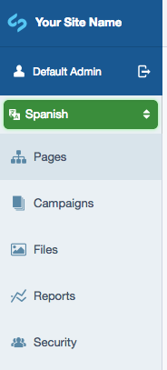

# Fluent

## Simple Silverstripe Localisation

This module allows websites to manage localisation of content, and navigation between localisations,
in a similar fashion to [Translatable](https://github.com/silverstripe/silverstripe-translatable)
or [Multilingual](https://github.com/kreationsbyran/multilingual).

Locales are distinguished by a url prefix, that of the selected locale, at the start
of all page links. E.g. `http://damian.geek.nz/en_NZ/about-me` would be the NZ English
version of a page. This could be localised into Maori at `http://damian.geek.nz/mi_NZ/about-me`

Fluent also integrates nicely with Google Sitemaps module, linking localisations for each page as per
[Google's internationalisation guidelines](https://support.google.com/webmasters/answer/182192?hl=en&ref_topic=2370587)

Fluent also supports the use of multiple domains to assist in locale filtering
(e.g. a .com for English, and a .cn for Chinese).

Back end control is provided by a simple CMS filter.

Also, please [report any issues](https://github.com/tractorcow-farm/silverstripe-fluent/issues)
you may encounter, as it helps us all out!

## Contributing

If you would like to contribute to Fluent, either via pull requests,
localisations, or being a part of the contributing team, please see
[the contributing guidelines](CONTRIBUTING.md)

## Credits and Authors

 * Damian Mooyman - <https://github.com/tractorcow-farm/silverstripe-fluent>
 * Robbie Averill - <https://github.com/robbieaverill> Migrating to SilverStripe 4.0
 * Attribution to Michael (dAKirby309) for his metro translate icon - <http://dakirby309.deviantart.com/>

## Requirements

 * SilverStripe 4.0.0 or above
 * PHP 7.1 or above

## Documentation

 * [Configuration](docs/en/configuration.md)
 * [Locale Detection](docs/en/locale-detection.md)
 * [Installation](docs/en/installation.md)
 * [Working with DataObjects](docs/en/dataobjects.md)
 * [Deployment under multiple domains](docs/en/domain-configuration.md)
 * [Templating for Fluent](docs/en/templating.md)
 * [How Fluent works](docs/en/how-fluent-works.md)
 * [Scenarios](docs/en/scenarios.md)
 * [Localised copy](docs/en/localised-copy.md)
 * [Versioned history](docs/en/versioned-history.md)
 * [Migrating from Translatable](docs/en/migrating-from-translatable.md)

## Translations

The translations for this project are managed via [Transifex](https://www.transifex.com/silverstripe/silverstripe-fluent)
and are updated automatically during the release process. To contribute, please head to the link above and get
translating!

## License

Revised BSD License

Copyright (c) 2018, Damian Mooyman

All rights reserved.

Redistribution and use in source and binary forms, with or without
modification, are permitted provided that the following conditions are met:

 * Redistributions of source code must retain the above copyright
   notice, this list of conditions and the following disclaimer.
 * Redistributions in binary form must reproduce the above copyright
   notice, this list of conditions and the following disclaimer in the
   documentation and/or other materials provided with the distribution.
 * The name of Damian Mooyman may not be used to endorse or promote products
   derived from this software without specific prior written permission.

THIS SOFTWARE IS PROVIDED BY THE COPYRIGHT HOLDERS AND CONTRIBUTORS "AS IS" AND
ANY EXPRESS OR IMPLIED WARRANTIES, INCLUDING, BUT NOT LIMITED TO, THE IMPLIED
WARRANTIES OF MERCHANTABILITY AND FITNESS FOR A PARTICULAR PURPOSE ARE
DISCLAIMED. IN NO EVENT SHALL <COPYRIGHT HOLDER> BE LIABLE FOR ANY
DIRECT, INDIRECT, INCIDENTAL, SPECIAL, EXEMPLARY, OR CONSEQUENTIAL DAMAGES
(INCLUDING, BUT NOT LIMITED TO, PROCUREMENT OF SUBSTITUTE GOODS OR SERVICES;
LOSS OF USE, DATA, OR PROFITS; OR BUSINESS INTERRUPTION) HOWEVER CAUSED AND
ON ANY THEORY OF LIABILITY, WHETHER IN CONTRACT, STRICT LIABILITY, OR TORT
(INCLUDING NEGLIGENCE OR OTHERWISE) ARISING IN ANY WAY OUT OF THE USE OF THIS
SOFTWARE, EVEN IF ADVISED OF THE POSSIBILITY OF SUCH DAMAGE.
